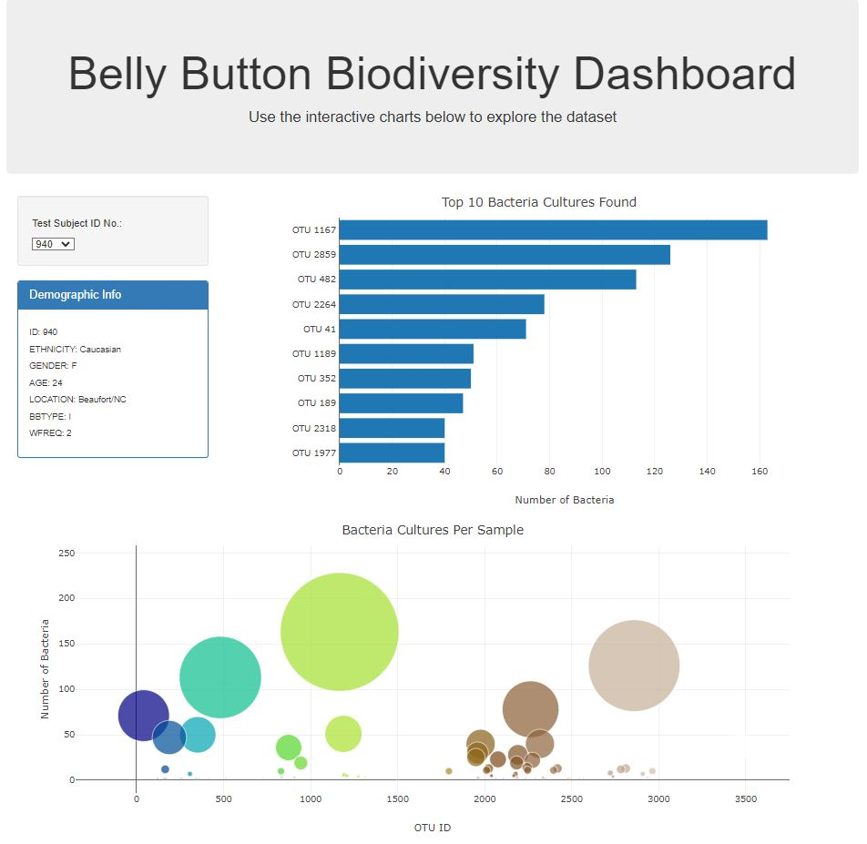

# Module_14_belly-button-challenge

JavaScript Visualizations

Background

In this assignment, you will build an interactive dashboard to explore the Belly Button Biodiversity datasetLinks to an external site., which catalogs the microbes that colonize human navels.
The dataset reveals that a small handful of microbial species (also called operational taxonomic units, or OTUs, in the study) were present in more than 70% of people, while the rest were relatively rare.

Project Overview

This project involves creating a web-based dashboard with the following features:

1. A Horizontal Bar Chart displaying the top 10 OTUs found in an individual’s sample.
2. A BubbleChart that plots the OTUs for each sample.
3. A Drop-Down Metadata Display showing key demographic information of the sample.

Final Project looks like the Following webpage:

File Structure

static.js: JavaScript files, includes the code to handle D3.js and Plotly.js.
index.html: The HTML structure for the dashboard.
License
Readme.md file: file that contains project description
sample.json file: JSON file containing the data
